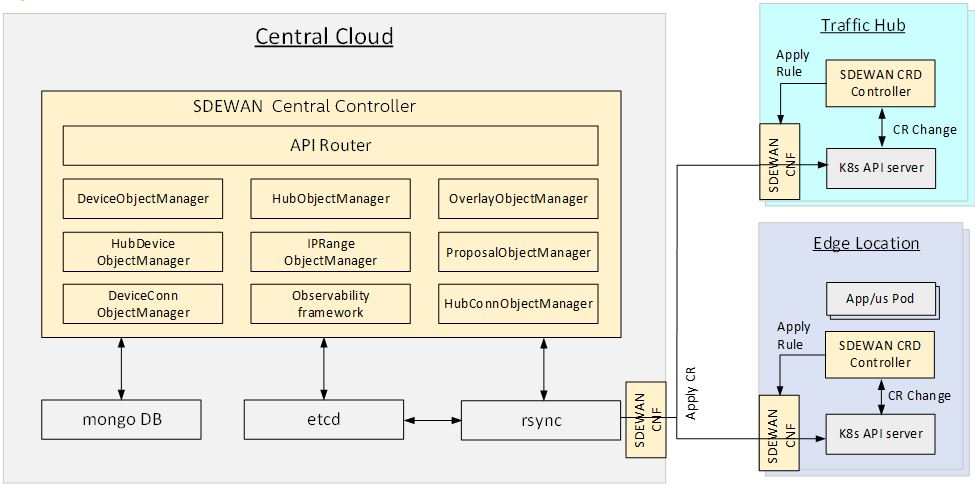
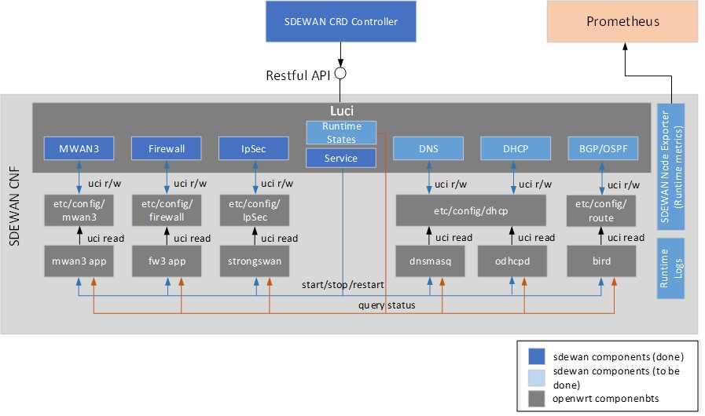
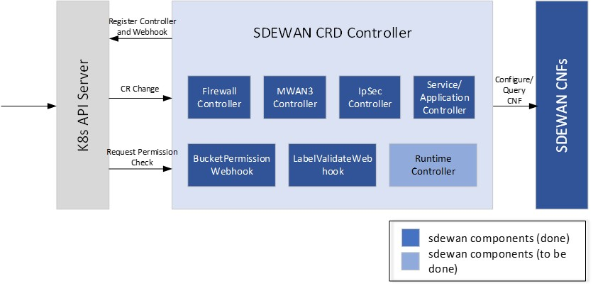
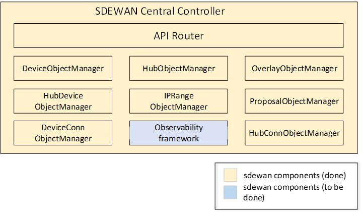

# Introduction to Akraino ICN SD-EWAN solution

SDEWAN is a solution to enable SDWAN functionalities include multiple WAN link support, WAN traffic management, NAT, firewall, IPSec and Traffic shaping etc. with focus to address the challenges when applying on edge computing environment like resource limitation, edge overlays, traffic sanitization, automation and cost sensitive etc. 

SD-EWAN main functionalities include

* IPsec tunnels across K8s clusters - Supporting multiple types of K8s clusters
"K8s clusters having static public IP address", "K8s clusters having dynamic public
IP address with static FQDN" and "K8s clusters with no public IP".
* Stateful inspection firewall (for inbound and outbound connections)
* Source NAT and Destination NAT for supporting K8s clusters whose POD and
ClusterIP subnets are overlapping.
* Multiple WAN link support

SD-EWAN is based on set of Linux packages

* mwan3 (for Multiple WAN link support)
* IPTables (for firewall, SNAT, DNAT)
* Strongswan (for IPsec)
* TC (Traffic Control)

## SD-EWAN in Akraino/ICN

SD-EWAN functionalities are realized via three components: Central Controller, CNF (Containerized Network Function)
and CRD controller that deployed through K8s. SD-EWAN CNF leverages Linux kernel functionality for packet
processing of above functions. Actual CNF is set of user space processes
consisting of fw3, mwan3, strongswan and others.

SD-EWAN is considered as platform feature by ICN.

### platform
SDEWAN platform features include cnf, cr definition and controller.

CNF is implemented based on OpenWRT, it enhances OpenWRT Luci web interface with SDEWAN controllers to provide Restful API for network functions' configuration and control. 

CRD controller is implemented as k8s CRD Controller, it manages CRDs (e.g. Firewall related CRDs, Mwan3 related CRDs and IpSec related CRDs etc.) and internally calls SDEWAN Restful API to do CNF configuration. And a remote client (e.g. SDEWAN Central Controller) can manage SDEWAN CNF configuration through creating/updating/deleting SDEWAN CRs.

### central-controller
central-controller provides central control of SDEWAN overlay networks by automatically configuring the SDEWAN CNFs through SDEWAN CRD controller located in edge location clusters and hub clusters.

## Comprehensive Documentation
- [How to use](platform/crd-ctrlr#deployment-guide)
- [Development](platform/crd-ctrlr#developer-guide)
- [Test](platform/test#sdewan-solution-e2e-test)
- [End2End](https://wiki.akraino.org/display/AK/ICN+R3+Test+Document#ICNR3TestDocument-SDEWAN)
- [Validation Result](https://wiki.akraino.org/display/AK/ICN+R3+Test+Document#ICNR3TestDocument-BluValTesting)

## Environment Settings Recommendations
To make our project work for your solution, please do the environment settings following the best practices that are widely known by the communities and industries.

### Host OS
First of all, please follow the best practices to configure your host operating system.
e.g. keep host OS components up-to-date and minimize host OS attack surface.

### Docker Image Usage
Please follow the best know practices of Docker in your development lifecycle that will give you more productivity and security.

- [Development Best Practices](https://docs.docker.com/develop/dev-best-practices/)
- [Image Build Best Practices](https://docs.docker.com/get-started/09_image_best/)
- [Only Use Trusted Registry Service Like Docker Hub](https://docs.docker.com/docker-hub/)
- [Using Docker Hub for CI CD](https://docs.docker.com/ci-cd/best-practices/)

### Kubernetes
Please follow the industry best practices for setting your Kubernetes clusters.
- [Kubernetes Security Tutorial](https://kubernetes.io/docs/tutorials/security/)
- [Kubernetes CIS Benchmark](https://www.aquasec.com/cloud-native-academy/kubernetes-in-production/kubernetes-cis-benchmark-best-practices-in-brief/)
- [Kube Bench](https://github.com/aquasecurity/kube-bench)

### Etcd
Etcd is a is a strongly consistent, distributed key-value store. It's a critical Kubernetes component which stores information on state and secrets, and it should be protected differently from the rest of your cluster. Administrators should always use strong credentials from the API servers to their etcd server, such as mutual auth via TLS client certificates, and it is often recommended to isolate the etcd servers behind a firewall that only the API servers may access.

Access to etcd (the datastore of Kubernetes) should be limited to the control plane only. Depending on your configuration, you should attempt to use etcd over TLS. More information can be found in the [etcd documentation](https://github.com/etcd-io/etcd/tree/master/Documentation).

Wherever possible, it's a good practice to encrypt all storage at rest. Since etcd holds the state of the entire cluster (including Secrets) its disk should especially be encrypted at rest. e.g. [Kubernetes documentation on encrypting data at rest](https://kubernetes.io/docs/tasks/administer-cluster/encrypt-data/)

### MongoDB
Please follow the best known practices of MongoDB
- [Basic Practices](https://www.mongodb.com/basics/best-practices)
- [Security Manual](https://www.mongodb.com/docs/manual/security/)
- [Encrypt Data At Rest](https://www.mongodb.com/docs/manual/core/security-encryption-at-rest/)

### Istio
Our project can be used with Istio to enable a secure running environment. Please follow the general practice of [the Istio Service Mesh](https://istio.io/latest/about/service-mesh/) and [Istio / Security](https://istio.io/latest/docs/concepts/security/) to complete the settings for your own solution. In addition to that, in order to get a general idea or quick impression about the usage, you can also reference our introduction to a [demo](https://github.com/intel-sandbox/akraino-sdewan/tree/main/central-controller/docs/istio).
Please also follow the best practices of Istio for [scalability and performace](https://istio.io/latest/docs/ops/deployment/performance-and-scalability/).

## Administration/Operation Guideline
Please follow the best practices for administration or operations.

e.g. We recommend you to follow the guidelines about the authentication lifecycle management in [Digital Identity Guidelines](https://pages.nist.gov/800-63-3/sp800-63b.html) that covers a broad range of that topic. Especially, please follow the guidelines in section "5.1.1.2 Memorized Secret Verifiers" in that document when you configure your secret verifiers.

### Account Management.
Please follow the best practices of industry to manage the accounts. e.g. authentication lockout or throttling, minimum password requirements, password of application should be protected, authentication error should be consistent, avoid authentication timing vulnerabilities, new user should be forced to change password etc.

### Certificate Management.
Please follow the best practices of industry to manange your certificate. e.g. https://kubernetes.io/docs/setup/best-practices/certificates/

## Contact Us

For any questions about this project, feel free to ask a question in
#general in the [ICN slack](https://akraino-icn-admin.herokuapp.com/), or open up a https://jira.opnfv.org/issues/.
